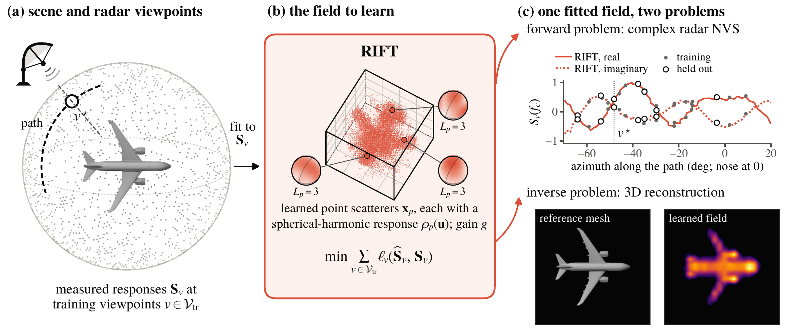
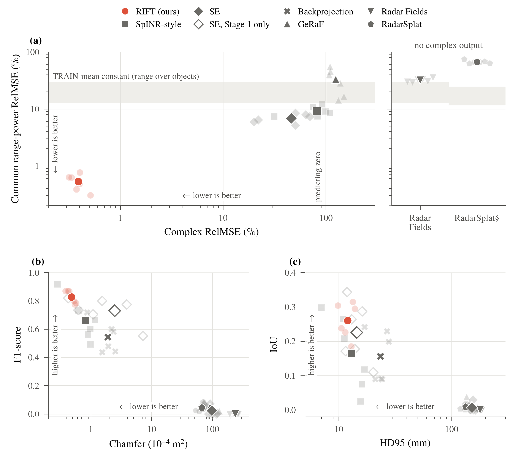
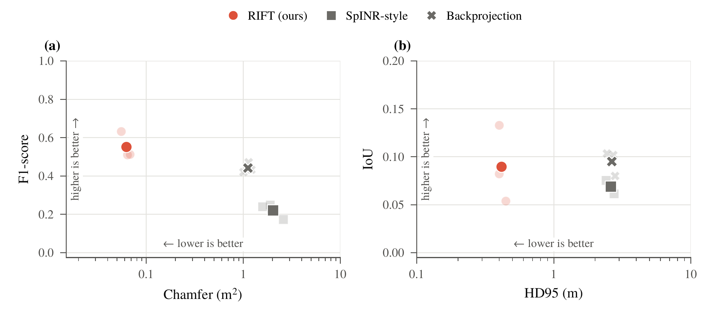
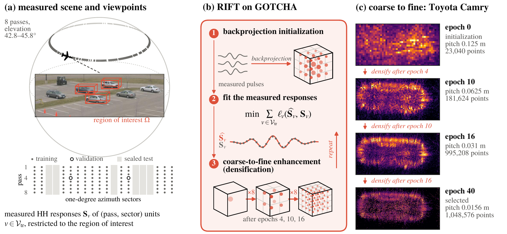
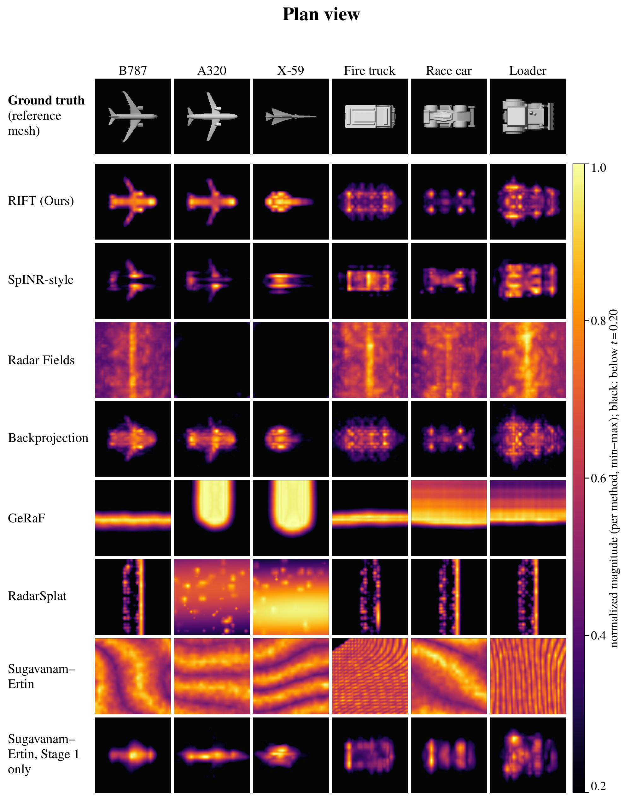
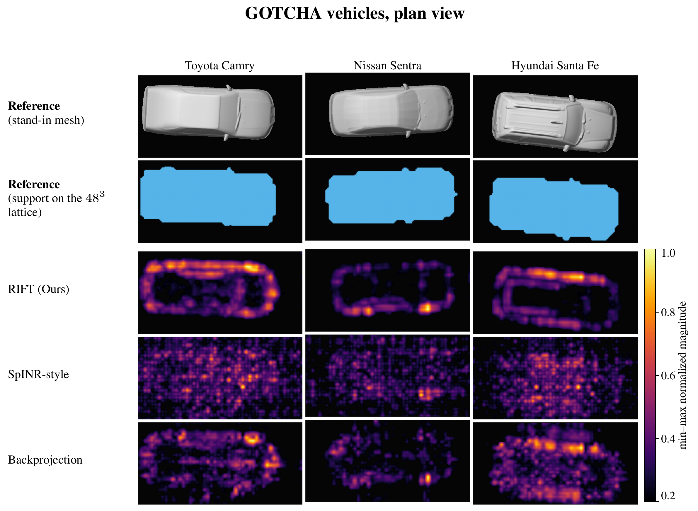

# Radon Implicit Field Transform: Fully Radar-Native Novel-View Synthesis and 3D Reconstruction

**Daqian Bao<sup>1</sup>, Alex Saad-Falcon<sup>1</sup>, Justin Romberg<sup>1</sup>**  
<sup>1</sup> [Georgia Institute of Technology](https://www.gatech.edu)

**XXXX 20XX Conference Submission** · [arXiv:2410.19801](https://arxiv.org/abs/2410.19801)

> **arXiv update pending:** The arXiv preprint has not yet been updated to the
> XXXX 20XX submission. The title, abstract, and results in this README reflect
> the submission last modified on 25 Sept 2026.

**Keywords:** 3D Reconstruction, Scene Representations, Inverse Problem, Radar Novel-View Synthesis (NVS)

**TL;DR:** RIFT is the first radar-native field that performs complex-valued
novel-view synthesis and 3D reconstruction with one model, trained only on
complex radar measurements and validated on simulated and real-world data.

## Abstract

We introduce the Radon Implicit Field Transform (RIFT), a fully radar-native
framework for complex-valued novel-view synthesis and 3D reconstruction that
combines an adaptive point-scatterer representation with a radar forward model.
Both initialization and optimization use only complex radar measurements and
calibrated sensor poses, without visual or LiDAR-derived priors, initialization,
or supervision. RIFT represents the scene with point scatterers at adaptive
spatial resolutions, with learnable positions and direction-dependent complex
reflectance parameterized by spherical harmonics. We incorporate the generalized
Radon transform as a forward model and optimize point-scatterer positions and
reflectance by matching predicted and measured complex radar signals. During
optimization, signal-loss gradients guide local increases in spatial resolution
and spherical-harmonic expansion degree; these capacity updates leave the current
signal predictions unchanged, except for the coarse-to-fine densification we use
on lower-resolution measured radar data. We evaluate complex-valued novel-view
synthesis by comparing forward-model predictions at unseen sensor poses with
held-out complex measurements, and evaluate 3D reconstruction by comparing
geometry extracted from the learned point scatterers with reference scene
geometry. On our simulated dataset, RIFT achieves a mean held-out complex
relative mean-squared error of $0.3909\%$ and a mean symmetric squared Chamfer
distance of $4.813\times10^{-5}\,\mathrm{m}^{2}$; on a real-world dataset, it
reduces the symmetric squared Chamfer distance by up to $95.12\%$ relative to the
strongest baseline, reaching $5.536\times10^{-2}\,\mathrm{m}^{2}$.

## Illustrations

Figure numbers follow the ICLR 2027 submission. These figures show the shared
radar field, quantitative comparisons, and the measured-data workflow.



**Figure 1 — One field, two tasks.** RIFT fits adaptive point scatterers with
direction-dependent complex reflectance to measured radar responses. The same
field predicts complex signals at unseen viewpoints and provides a 3D scene
reconstruction.



**Figure 2 — Simulated-data performance.** Complex-signal and matched-range
power errors, alongside Chamfer distance, F1-score, HD95, and IoU. Faint markers
show individual objects; solid markers show six-object means. RIFT is
red-orange. Radar Fields and RadarSplat produce power-domain outputs; RadarSplat's
range-power score uses its image's range crop.



**Figure 3 — Real-world GOTCHA performance.** Geometry comparisons across the
Toyota Camry, Nissan Sentra, and Hyundai Santa Fe. Faint markers show individual
vehicles; solid markers show three-vehicle means, with RIFT in red-orange.



**Figure 4 — RIFT on GOTCHA.** The measured-data workflow combines
backprojection initialization, fitting of complex radar responses, and
coarse-to-fine densification. The right column shows the Camry field from
initialization through the selected epoch-40 checkpoint. The parking-lot photo
is from [Casteel et al. (2007), Figure 2](https://doi.org/10.1117/12.731457).

## Reconstruction results

The following plan views compare the reconstructed scattering support with the
reference geometry. Method panels use a fixed threshold of $t=0.20$ and
per-method min–max normalized magnitude; brightness is not a shared physical
scale across methods.



**Figure 10 — Six simulated scenes.** Each column is one object. The top row
shows the ground-truth reference meshes, followed by RIFT and the comparison
methods, viewed with matching cameras and crops. The two Sugavanam–Ertin rows
show the full two-stage method and the Stage-1 scattering field separately.



**Figure 13 — Three measured GOTCHA vehicles.** The top two rows show registered
same-generation stand-in meshes and their support on the $48^3$ evaluation
lattice. The remaining rows compare RIFT, SpINR-style, and backprojection using
the full 2,410-unit training split. The meshes are geometric references rather
than scans of the measured vehicles. Model credits: Nieve5677 (Camry), Lone Wolf
(Sentra), and teenlin3 (Santa Fe); see the
[reference-mesh sources and licenses](docs/GOTCHA_REFERENCE_MESHES.md).

Figure sources and export details are recorded in
[`assets/figures/README.md`](assets/figures/README.md).

## Intel PVC implementation

RIFT (Radon Implicit Field Transform) learns a direction-dependent complex
scattering field from radar measurements for novel-view signal prediction and
3D reconstruction. This repository publishes the Intel Data Center GPU Max
(PVC / PyTorch XPU) implementation, its dataset frontends, and the incorporated
baselines.

The training and backend source is copied from the working RIFT project. Shared
`rift/` modules and original trainers are included because the PVC entrypoints
import them. Dataset measurements, reference meshes, trained checkpoints,
experiment caches, and credentials are not part of this source release.

## Included methods

| Method | PVC entrypoint | Implementation |
| --- | --- | --- |
| RIFT | `train_pvc.py` | Shared RIFT field/operator with XPU execution |
| SpINR | `train_spinr_style_pvc.py` | Independent implementation of the paper, with disclosed acquisition and budget choices |
| GeRaF | `train_geraf_pvc.py` | Vendored GeRaF-SENS components and PVC bindings |
| Radar Fields | `train_radar_fields_pvc.py` | Upstream source with the separate `upstream-tcnn-torchshim` PVC backend |
| RadarSplat | `train_radarsplat_pvc.py` | Upstream source with separate Torch implementations of its rasterizer and SSIM operations |
| Sugavanam–Ertin | `train_sugavanam_ertin_pvc.py` | Independent paper implementation; Stage 1/2 entrypoints and vendored SPGL1 are included |
| RIFT-SAS / SH-SAS | `train_sas_pvc.py`, `train_sh_sas_pvc.py` | Additional sonar code and the radar-adapted SH-SAS implementation |

The two canonical radar frontends are
[`train_rift_dataset_pvc.py`](train_rift_dataset_pvc.py) for the six synthetic
objects and [`train_gotcha_dataset_pvc.py`](train_gotcha_dataset_pvc.py) for GOTCHA.
Backend availability and compatibility are reported by each frontend's `--list`
option. A method's presence in the source tree does not imply that every dataset
or paper table used that method.

## Environment

Use an Intel GPU allocation with a compatible driver. The environment is pinned
in [`requirements-pvc.yaml`](requirements-pvc.yaml), including Python 3.10.16
and PyTorch 2.12.1+XPU. Do not load CUDA or Intel compiler modules over the XPU
wheel's bundled runtime.

```bash
conda env create -f requirements-pvc.yaml
conda install -n RIFT-PVC -c conda-forge --override-channels \
  open3d=0.19.0 numpy=1.26.0 matplotlib-base=3.10.1 pillow=11.1.0 \
  python=3.10.16 pip=25.0 setuptools=75.8.0 wheel=0.45.1

# Set this to persistent scratch on a cluster.
export RIFT_PVC_CACHE_ROOT=/path/to/persistent/scratch/rift-public-cache
source .local-setup/activate-public-pvc.sh
```

Set `RIFT_PVC_ENV` before activation if using an environment prefix or another
environment name. Copy [`.env.datasets.example.sh`](.env.datasets.example.sh)
to `.env.datasets.sh` and edit the data/output locations; the public activation
helper loads that local file if present. It is excluded from Git.

The original `.local-setup/activate-pvc.sh` and Slurm launchers are preserved as
ACES configurations. They contain the original account, source, data, and
scratch paths. Adapt those paths and scheduler settings before submitting them
from another checkout or machine. Direct Python entrypoints accept explicit
dataset and output paths.

An `Aten Op fallback from XPU to CPU` warning indicates a backend defect; it is
not an accepted execution mode for PVC runs. See
[`docs/PVC_ENVIRONMENT_PLAN.md`](docs/PVC_ENVIRONMENT_PLAN.md).

## Dataset frontends

Run these commands from the repository root after configuring the data paths.
Planning examples below use `--dry-run` and do not start training.

```bash
python train_rift_dataset_pvc.py --list
python train_gotcha_dataset_pvc.py --list

python train_rift_dataset_pvc.py \
  --dataset-root "$RIFT_DATA_ROOT" --object b787 --method rift \
  --num-tx 1 --num-rx 1 --num-train 2400 \
  --output-root "$RIFT_RUN_ROOT" --dry-run

python train_gotcha_dataset_pvc.py \
  --dataset-root "$GOTCHA_DATA_ROOT" --method rift --polarizations hh \
  --num-tx 1 --num-rx 1 --output-root "$GOTCHA_RUN_ROOT" --dry-run
```

Select the intended region, shards, protocol, antenna IDs, frequency selection,
and method configuration before fitting. Removing `--dry-run` executes the
selected plan; the examples are not a replacement for a complete experimental
recipe. Keep caches and checkpoints on persistent scratch. Resume with the same
output root, acquisition, roles, recipe, and saved optimizer state. Reserved
test responses remain sealed during training and model selection.

Prepared AirSAS caches can be used with `train_sas_pvc.py` and
`scripts_pvc_sas/run_airsas_comparison_pvc.sh`. Rebuilding caches from raw Reed
system-data pickles additionally requires the authors'
[Reed source checkout](https://github.com/awreed/Neural-Volumetric-Reconstruction-for-Coherent-SAS)
via `--reed-root` / `REED_ROOT`; that optional checkout was absent from the
working source tree and is not included here.

## Source layout

| Path | Contents |
| --- | --- |
| `rift_pvc/` | XPU adapters, baseline backends, GOTCHA training, regions, and vendored PVC dependencies |
| `scripts_pvc/` | Preparation, launch, recovery, evaluation, rendering, and campaign tools |
| `rift_pvc_sas/`, `scripts_pvc_sas/` | Sonar PVC implementation and tools |
| `rift/`, root trainers, `scripts/` | Shared implementations and tools imported by the PVC paths |
| `external/` | Radar Fields, RadarSplat/GLM, and FRTM reference sources |
| `protocols/` | Dataset and model configurations |
| `docs/` | Dataset contracts, model adaptation details, and numerical recipes |
| `tests/`, package test directories | Existing source tests, copied without running them for this release |
| `slurm/` | Original shared launch configurations |

Start with the [frontend contract](docs/DATASET_FRONTEND_CONSOLIDATION.md),
[scene budgets](docs/SCENE_BUDGET.md), and
[training recipes](docs/TRAINING_RECIPES.md). Baseline-specific notes describe
the distinctions between original implementations, independent reproductions,
and PVC replacements. Complex-signal, power-domain, and geometry metrics have
different meanings and should be reported with their acquisition and recipe.

## Acknowledgements

We thank NSF ACCESS project CIS261724 and Texas A&M University for providing
the computing credits and infrastructure that supported this work.

Research-funding acknowledgements will be added upon publication.

## Provenance and third-party notices

[`SOURCE_PROVENANCE.json`](SOURCE_PROVENANCE.json) records the parent repository,
selected Git commit, working-tree additions, copied file inventory, and upstream
repositories/commits. Source availability is checked using required files and
APIs, without content-hash acceptance gates. Historical hash inventories copied
from the project are documentation only.

Third-party sources retain their own terms and attribution; see
[`THIRD_PARTY_NOTICES.md`](THIRD_PARTY_NOTICES.md) and the adjacent license files.
This release does not assign a new blanket license to the combined source tree.
